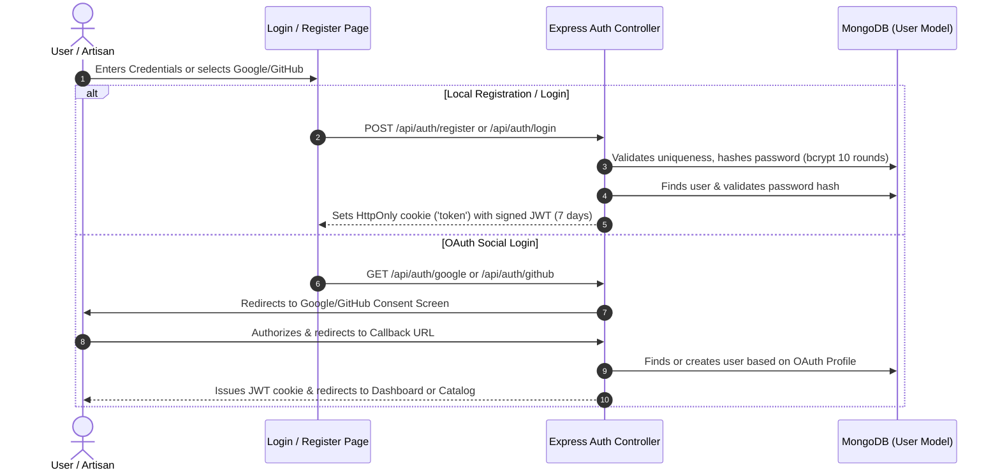
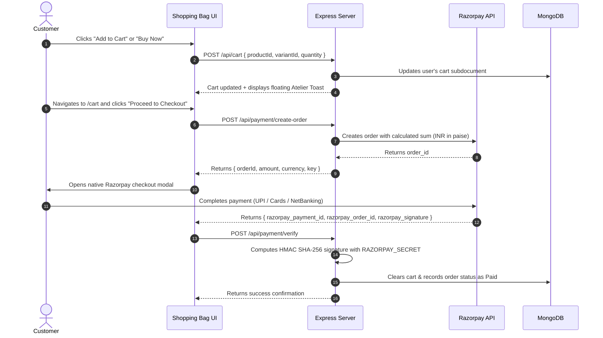

# VASTRA LOOM — Haute Couture Monolithic Platform

> **Royal Bespoke Menswear & Artisanal Handloom E-Commerce Platform**  
> An enterprise-grade full-stack monolithic application serving luxury Indian ethnic menswear (Royal Velvet Blazers, Heritage Sherwanis, Tuxedo Bandhgalas, Jodhpur Achkans, and Nawabi Kurta Sets) with real-time variant switching, ImageKit media optimization, Razorpay white-glove checkout, and dual-seller inventory controls.

---

## Table of Contents
1. [Platform Overview & Design Identity](#1-platform-overview--design-identity)
2. [Architectural Overview (Monolith)](#2-architectural-overview-monolith)
3. [Technology Stack](#3-technology-stack)
4. [End-to-End System Workflows](#4-end-to-end-system-workflows)
   - [Authentication & Role Management](#41-authentication--role-management)
   - [Customer Shopping & Catalog Flow](#42-customer-shopping--catalog-flow)
   - [Bespoke Variant & Attribute Engine](#43-bespoke-variant--attribute-engine)
   - [Shopping Bag & Razorpay Payment Integration](#44-shopping-bag--razorpay-payment-integration)
   - [Seller Atelier Studio & Inventory Management](#45-seller-atelier-studio--inventory-management)
5. [Database Architecture & Data Models](#5-database-architecture--data-models)
6. [API Specification & Endpoints](#6-api-specification--endpoints)
7. [Media Architecture (ImageKit.io Integration)](#7-media-architecture-imagekitio-integration)
8. [Hosting & Deployment Guide](#8-hosting--deployment-guide)
   - [Vercel Deployment (Serverless Monolith)](#81-vercel-deployment-serverless-monolith)
   - [Render Deployment (Persistent Web Service)](#82-render-deployment-persistent-web-service)
9. [Local Development & Build Scripts](#9-local-development--build-scripts)
10. [Environment Variables Reference](#10-environment-variables-reference)

---

## 1. Platform Overview & Design Identity

**VASTRA LOOM** represents royal Indian haute couture. The user interface embodies a high-end luxury atelier with micro-interactions, smooth image zooms, and curated palettes:

- **Noir Sévère (Default)**: Deep obsidian canvas (`#080806`), antique brushed gold accents (`#C6A87C`), and subtle warm amber glows.
- **Ivory Atelier**: Pristine silk alabaster (`#FBF9F6`), warm beige cards, and muted gold leaf details.
- **Imperial Emerald**: Rich malachite tones (`#04130E`) with imperial brass highlights.

Typography is anchored on **Geist Variable** and **Remix Icon** vector glyphs, fully responsive across mobile, tablet, and 4K displays.

---

## 2. Architectural Overview (Monolith)

The platform is designed as a **unified, zero-friction Monolith**:

```mermaid
graph TD
    Client["Client Browser (React SPA)"]
    VercelEdge["Vercel Global Edge / Render Reverse Proxy"]
    ExpressApp["Express 5 Backend Server"]
    StaticPublic["Static Assets & SPA (Backend/public)"]
    APIEndpoints["REST API Endpoints (/api/...)"]
    MongoDB[("MongoDB Atlas Database")]
    ImageKit["ImageKit.io Media CDN"]
    Razorpay["Razorpay Payment Gateway"]
    OAuth["OAuth Providers (Google & GitHub)"]

    Client -->|All Requests| VercelEdge
    VercelEdge -->|Static Assets (*.js, *.css, images)| StaticPublic
    VercelEdge -->|API Calls & Page Navigations| ExpressApp
    ExpressApp -->|SPA Fallback for Client Routes| StaticPublic
    ExpressApp -->|Data Queries| MongoDB
    ExpressApp -->|Buffer Uploads & Optimization| ImageKit
    ExpressApp -->|Order Creation & Verification| Razorpay
    ExpressApp -->|Social Identity Verification| OAuth
```

### Key Architectural Strengths:
1. **Single Domain / Zero CORS Friction**: Both frontend assets and backend API requests share the identical domain in production. There are no port mismatches, third-party cookie restrictions, or preflight overhead.
2. **Express 5 SPA Fallback Middleware**: Any browser navigation (e.g. `/product/6aba...`, `/login`, `/cart`, `/seller/dashboard`) seamlessly serves `index.html` without breaking on page refresh.
3. **Optimized Asset Pipeline**: `sync_frontend.js` compiles the Vite frontend and synchronizes the optimized distribution into `Backend/public/` with a single command.

---

## 3. Technology Stack

### Frontend Architecture
- **Framework**: React 19 + Vite (Fast HMR & Tree-shaken build)
- **Styling**: Tailwind CSS v4 + Vanilla CSS Design Tokens
- **Icons & Typography**: Remix Icon + Geist Variable font
- **State Management**: Redux Toolkit (`@reduxjs/toolkit` for Cart & Auth)
- **Animations**: Motion (`motion/react`) for smooth micro-animations
- **Routing**: React Router v7 (`createBrowserRouter` / `RouterProvider`)
- **API Client**: Axios with configured interceptors & credentials

### Backend Architecture
- **Runtime**: Node.js v22+
- **Server Framework**: Express 5.2.1
- **Database & ODM**: MongoDB Atlas + Mongoose 9
- **Authentication**: JWT (`jsonwebtoken`) in `HttpOnly` cookies + `bcryptjs`
- **Social Auth**: Passport.js (`passport-google-oauth20`, `passport-github2`)
- **Media CDN**: `@imagekit/nodejs` SDK for cloud uploads and transformations
- **Payments**: Razorpay Node.js SDK with cryptographic HMAC SHA-256 signature verification
- **File Ingestion**: Multer memory storage

---

## 4. End-to-End System Workflows

### 4.1. Authentication & Role Management

The platform supports dual roles: **Buyer** and **Seller**.



- **Protection**: Routes are protected via `authenticateUser` and `authenticateSeller` middlewares.
- **Client Sync**: On page load, `Navbar` and `useAuth` hook query `/api/auth/me` to hydrate active session state.

---

### 4.2. Customer Shopping & Catalog Flow

1. **Hero Stage & Curated Showcase**:
   - The homepage features an Autumn/Winter haute couture banner, search bar with debounce, and category pills (*All, Bandhgalas, Sherwanis, Velvet*).
2. **Product Exploration**:
   - Pieces render with high-resolution ImageKit CDN previews, bespoke badges, dynamic discount pills, and real-time inventory indicators.
3. **Product Detail View (`ProductDetail.jsx`)**:
   - **Zero-Jitter Thumbnail Gallery**: A vertical thumbnail rail with `overflow-x-hidden` and `no-scrollbar` prevents layout reflows and scrollbar flicker.
   - **Smooth Hover Zoom**: Inner images expand smoothly (`group-hover:scale-110 duration-500`) without altering the bounding box or shifting adjacent elements.
   - **High-Resolution Main Stage**: Displays active selected image with 1200px dynamic ImageKit query parameters.

---

### 4.3. Bespoke Variant & Attribute Engine

Unlike simple e-commerce apps with static sizes, VASTRA LOOM features an enterprise **variant attribute engine**:

- A product consists of a **Master Base Piece** plus **Optional Bespoke Editions (Variants)**.
- Each variant stores:
  - An attribute map: `{ Color: "Emerald Green", Size: "42", Silhouette: "Double Vent" }`
  - Independent pricing (`price.amount`, `price.currency`)
  - Dedicated discount & original MRP
  - Independent stock count
  - Variant-specific image gallery
- **Interactive Switching**: Clicking a variant swatch dynamically updates the hero image, price, discount badge, stock availability, and specs showcase without page reload.
- **One-Click Reset**: A *"Reset to Original"* button restores the atelier master edition instantly.

---

### 4.4. Shopping Bag & Razorpay Payment Integration



---

### 4.5. Seller Atelier Studio & Inventory Management

Sellers have an autonomous studio dashboard (`/seller/dashboard`):

1. **Portfolio Overview**: Total published pieces, inventory units, valuation metrics.
2. **Craft New Piece**:
   - Multi-file image uploader with direct ImageKit synchronization.
   - Title, description, price, MRP, and stock inputs.
3. **Manage Pricing & Discounts (`ManageDiscountModal.jsx`)**:
   - Interactive slider and percentage input.
   - Automatically computes new selling price from MRP or vice versa.
4. **Craft Variant Editions (`CraftVariantModal.jsx`)**:
   - Allows sellers to attach custom attributes (e.g. `Fabric`, `Weave`, `Size`, `Color`) to existing pieces.
   - Uploads variant-specific media to ImageKit.
5. **Per-Variant Stock Adjustments**:
   - Slide-out atelier inventory drawer to adjust stock counts per variant in real time.
6. **Retire / Delete Product (`DeleteProductModal.jsx`)**:
   - Confirmation modal ensuring pieces can be retired safely.

---

## 5. Database Architecture & Data Models

### User Model (`user.model.js`)
```javascript
{
  email: { type: String, required: true, unique: true },
  fullname: { type: String, required: true },
  password: { type: String }, // Hashed with bcrypt
  contact: { type: String },
  role: { type: String, enum: ["buyer", "seller"], default: "buyer" },
  googleId: { type: String },
  githubId: { type: String }
}
```

### Product Model (`product.model.js`)
```javascript
{
  title: { type: String, required: true },
  description: { type: String, required: true },
  seller: { type: mongoose.Schema.Types.ObjectId, ref: 'user', required: true },
  price: {
    amount: { type: Number, required: true },
    currency: { type: String, enum: ["USD", "EUR", "GBP", "JPY", "INR"], default: "INR" }
  },
  discount: { type: Number, default: 0, min: 0, max: 99 },
  originalPrice: { type: Number, default: null },
  stock: { type: Number, default: 0 },
  images: [{ url: { type: String, required: true } }],
  variants: [
    {
      attributes: { type: Map, of: String },
      price: { amount: Number, currency: String },
      discount: { type: Number, default: 0 },
      originalPrice: { type: Number, default: null },
      stock: { type: Number, default: 0 },
      images: [{ url: { type: String, required: true } }]
    }
  ]
}
```

### Cart Model (`cart.model.js`)
```javascript
{
  user: { type: mongoose.Schema.Types.ObjectId, ref: 'user', required: true, unique: true },
  items: [
    {
      product: { type: mongoose.Schema.Types.ObjectId, ref: 'product', required: true },
      variantId: { type: mongoose.Schema.Types.ObjectId, default: null },
      quantity: { type: Number, required: true, min: 1, default: 1 }
    }
  ]
}
```

---

## 6. API Specification & Endpoints

### Authentication (`/api/auth`)
| Method | Endpoint | Description | Access |
| :--- | :--- | :--- | :--- |
| `POST` | `/api/auth/register` | Register buyer or seller | Public |
| `POST` | `/api/auth/login` | Log in with email & password | Public |
| `POST` | `/api/auth/logout` | Clear auth token cookie | Public |
| `GET` | `/api/auth/me` | Fetch currently authenticated user | Authenticated |
| `GET` | `/api/auth/google` | Trigger Google OAuth 2.0 flow | Public |
| `GET` | `/api/auth/github` | Trigger GitHub OAuth flow | Public |

### Products (`/api/products`)
| Method | Endpoint | Description | Access |
| :--- | :--- | :--- | :--- |
| `GET` | `/api/products` | Fetch all catalog products | Public |
| `GET` | `/api/products/:id` | Fetch full details for a product | Public |
| `GET` | `/api/products/seller` | Fetch products belonging to authenticated seller | Seller Only |
| `POST` | `/api/products` | Create a new product (with Multer file uploads) | Seller Only |
| `PUT` | `/api/products/:id/discount` | Update product price & discount | Seller Only |
| `PUT` | `/api/products/:id/stock` | Update base product stock | Seller Only |
| `DELETE` | `/api/products/:id` | Delete/retire product | Seller Only |
| `POST` | `/api/products/:productId/variants` | Add new variant edition | Seller Only |
| `PATCH` | `/api/products/:productId/variants/:variantId/stock` | Update variant stock | Seller Only |

### Cart (`/api/cart`)
| Method | Endpoint | Description | Access |
| :--- | :--- | :--- | :--- |
| `GET` | `/api/cart` | Retrieve user shopping bag | Authenticated |
| `POST` | `/api/cart/add` | Add product/variant to bag | Authenticated |
| `PATCH` | `/api/cart/update` | Update item quantity | Authenticated |
| `DELETE` | `/api/cart/remove/:productId` | Remove item from bag | Authenticated |

### Payments (`/api/payment`)
| Method | Endpoint | Description | Access |
| :--- | :--- | :--- | :--- |
| `POST` | `/api/payment/create-order` | Create Razorpay order | Authenticated |
| `POST` | `/api/payment/verify` | Verify payment signature and complete order | Authenticated |

---

## 7. Media Architecture (ImageKit.io Integration)

All images are ingested through `Backend/src/services/storage.service.js` using `@imagekit/nodejs`:

1. **Storage Folder**: Assets are quarantined into the `VASTRA_LOOM/` folder in ImageKit.
2. **Buffer Stream Upload**: Express uses `multer({ storage: multer.memoryStorage() })`. The image buffer is streamed to ImageKit:
   ```javascript
   const result = await client.files.upload({
       file: await ImageKit.toFile(buffer),
       fileName,
       folder: "VASTRA_LOOM"
   });
   ```
3. **Adaptive CDN Transformations**: On the frontend, `getImageUrl(img, width)` dynamically generates high-performance WebP/AVIF transformations on the fly:
   `https://ik.imagekit.io/Rishi749/VASTRA_LOOM/file.jpg?tr=w-1200,q-85,f-auto`

---

## 8. Hosting & Deployment Guide

### 8.1. Vercel Deployment (Serverless Monolith)

The project includes pre-configured **Serverless entrypoints** and **Edge rewrite rules**:
- [`Backend/api/index.js`](file:///d:/Full-%20Stack%20By%20Sheriyans/Backend/Snitch%20Project/Backend/api/index.js): Serverless handler that caches MongoDB connections.
- [`Backend/vercel.json`](file:///d:/Full-%20Stack%20By%20Sheriyans/Backend/Snitch%20Project/Backend/vercel.json): Routes `/api/*` to the serverless function and falls back to `public/index.html`.

#### Steps to Deploy on Vercel:
1. Commit and push your code to GitHub:
   ```bash
   git add .
   git commit -m "feat: monolithic architecture ready for production"
   git push origin main
   ```
2. In [Vercel Dashboard](https://vercel.com/): Click **Add New...** → **Project** → Import `Snitch-Project`.
3. In **Root Directory**, click **Edit** and choose **`Backend`**.
4. In **Framework Preset**, select **Express** or **Other**.
5. Under **Build and Output Settings**:
   - Leave **Build Command** toggle **OFF** (or empty).
   - Leave **Output Directory** toggle **OFF** (`N/A`).
6. Under **Environment Variables**, add the keys from your `.env` (listed in Section 10).
7. Click **Deploy**.

---

### 8.2. Render Deployment (Persistent Web Service)

Render runs an actual long-running Node.js process, ideal for continuous database connection pooling:
- [`render.yaml`](file:///d:/Full-%20Stack%20By%20Sheriyans/Backend/Snitch%20Project/render.yaml): Blueprint configuration for instant 1-click deployment.

#### Steps to Deploy on Render:
1. In [Render Dashboard](https://dashboard.render.com/): Click **New +** → **Web Service** → Select your repo.
2. Configure settings:
   - **Root Directory**: `Backend`
   - **Build Command**: `npm install`
   - **Start Command**: `node server.js`
   - **Environment**: `Node`
3. Add your environment variables in the Render settings panel.
4. Click **Deploy Web Service**.

---

## 9. Local Development & Build Scripts

### Synchronize Frontend Changes into Monolith:
Whenever you make updates to files in `Frontend/src`, run the root sync script:
```bash
node sync_frontend.js
```
This builds Vite and copies all distribution assets directly into `Backend/public`.

### Running Locally:
1. **Start Monolithic Server** (Serves both frontend and APIs):
   ```bash
   cd Backend
   npm run dev
   ```
   Open **http://localhost:8080** in your browser.

2. **Independent Dev Servers** (Optional dual-server development):
   - Backend API: `cd Backend && npm run dev` (Port `8080`)
   - Frontend Vite HMR: `cd Frontend && npm run dev` (Port `5173` or `5174`)

---

## 10. Environment Variables Reference

Create a `.env` file inside `Backend/` with the following variables:

```ini
PORT=8080
NODE_ENV=production
MONGO_URL=mongodb+srv://<username>:<password>@cluster0.dwfqrqu.mongodb.net/Snitch
JWT_SECRET=your_jwt_secret_key

# ImageKit Media Credentials
IMAGEKIT_PRIVATE_KEY=your_imagekit_private_key

# OAuth Providers
GOOGLE_CLIENT_ID=your_google_client_id.apps.googleusercontent.com
GOOGLE_CLIENT_SECRET=your_google_client_secret
GITHUB_CLIENT_ID=your_github_client_id
GITHUB_CLIENT_SECRET=your_github_client_secret

# Razorpay Payment Gateway
RAZORPAY_KEY=your_razorpay_key
RAZORPAY_SECRET=your_razorpay_secret

# Optional: Set in production if deploying separate domains (defaults to relative same-origin)
CLIENT_URL=https://your-app.vercel.app
```

---

*Handcrafted with artisanal precision for VASTRA LOOM Haute Couture.*
